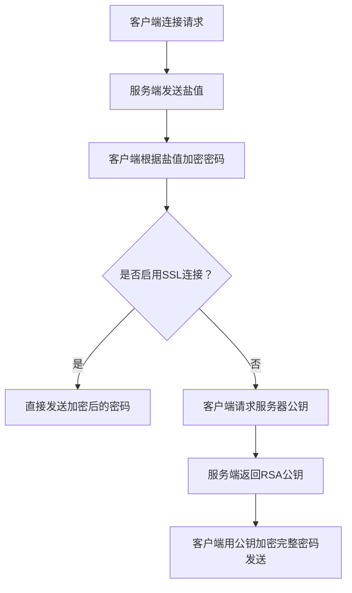

# MySQL 8.0 公钥检索错误及解决方案

## 一、问题现象与错误背景

在使用 MySQL Connector/J 8.0 及以上版本连接 MySQL 8.0 数据库时，常见报错如下：

```
java.sql.SQLNonTransientConnectionException: Public Key Retrieval is not allowed
```

### 典型触发场景

- 使用新版 JDBC 驱动（版本≥8.0）
- 未启用 SSL 加密连接
- 采用默认的 `caching_sha2_password` 认证插件
- 连接字符串未显式允许公钥检索

通过抓包工具（如 Wireshark）分析可以看到，客户端试图通过非加密通道请求服务器的 RSA 公钥，但请求被拒绝。此安全限制是 MySQL 8.0 引入的防御机制，目的是防止中间人攻击，保障身份验证的安全性。

---

## 二、核心原因解析

### 1. 身份验证机制的演变

MySQL 8.0 默认认证插件由之前的 `mysql_native_password` 切换至更安全的 `caching_sha2_password`，其密码验证流程也随之变化：



### 2. JDBC 驱动的安全策略升级

MySQL Connector/J 8.0 以后默认值为：

```properties
allowPublicKeyRetrieval=false
useSSL=false
```

默认禁止在未加密（非SSL）通道下获取服务器公钥，从而导致连接失败。

### 3. 密码交换协议调整

`caching_sha2_password` 认证流程简述：

- 客户端发送“scrambled（混淆式）”密码
- 服务端先尝试缓存的密码验证，如失败则请求完整密码
- 若 SSL 未启用，完整密码必须通过 RSA 公钥加密传输

---

## 三、版本兼容性说明

|版本|默认身份验证插件|需注意点|
|---|---|---|
|MySQL 5.7|`mysql_native_password`|通常无需调整此配置|
|MySQL 8.0+|`caching_sha2_password`|必须显式处理公钥检索|
|JDBC Driver|8.0.23及以上推荐|修复了部分公钥检索相关bug|

---

## 四、六种解决方案简要概述

本问题有六种可选解决方案，以下为常见有效方式之一示例：

在连接字符串中添加参数，显式允许公钥检索：

```
jdbc:mysql://host:3306/yourdb?allowPublicKeyRetrieval=true&loggerLevel=FINE
```

同时建议开启 SSL，保障数据传输安全。

---

## 五、总结

通过上述方法，可以有效解决 MySQL 8.0 因公钥检索限制导致的连接错误，在方便开发的同时，需合理平衡安全性和便利性。建议开发者充分了解认证机制与驱动配置，结合实际场景做出最佳调整。

# 参考资料

[**MySQL8.0 Public Key Retrieval错误与6种解决方案**](https://refblogs.com/article/994)

[Public Key Retrieval is not allowed](https://www.cnblogs.com/shujuyr/p/18877420)


